## Project Summary

# Design
The goal of this project is to create a digital marketplace & auctioneering site, where users can browse,  purchase, and review products.

More specifically, the design for this site revolves around a combination digital marketplace and auction house, which will serve as another piece of interactive fiction, as per my first milestone project.
The reason for this is fairly simple, it adds additional familiarity to the setting to allow for more naturalistic roleplaying, 
can potentially serve as an extension of gameplay for tabletop RPGs using the setting, and finally could potentially provide story hooks for future plot events in the setting.

To accomplish this, the site need to have a believable format, and the best way to accomplish this is to put a high-quality and professional-looking front on the site,
along side responsive design elements to give a higher-budget feel to the site design.

#### Similar Sites/Competitors
During the research portion of the design, I looked into sites for the same niche, so auctioneering sites. I have compiled a shortlist of three such sites, 
in order to acertain the common design elements to each of these sites and make sure to implement them into the finished project.

[Ebay](https://www.ebay.co.uk/)

[The Sale Room](https://www.the-saleroom.com/en-gb)

[John Pye Auctions](https://www.johnpye.co.uk/)

In addition to these three sites, I have looked into digital marketplaces where set goods are sold, or where small businesses or sole traders can sell their products.
Once again, I have looked for common design elements in these sites:

[Etsy](https://www.etsy.com/)

[Amazon](https://www.amazon.co.uk/)

---
#### Scope

In order for this project to be considered complete it must implement full CRUD functionality via front-end input & use the Stripe payment system to sell goods or services.
It must do this as a multi-app django project featuring full use of javascript, python, html, css, and a relational database of some kind. Additionally, it must implement a user authentication
 system of some sort, allowing users to log in and out, and have a good reason to allow this.

#### User Stories
After the previous research stages, a set of user stories have been created. This was done in a spreadsheet not only to provide an easy viewing experience, but also to ease testing later down the line.

[User Story Spreadsheet](designs/fsf_userstories_v1.xlsx)

---

### Skeleton
From the above user stories, some prototype visual designs have been created to provide structure to future development and inform the layout of the DOM tree.

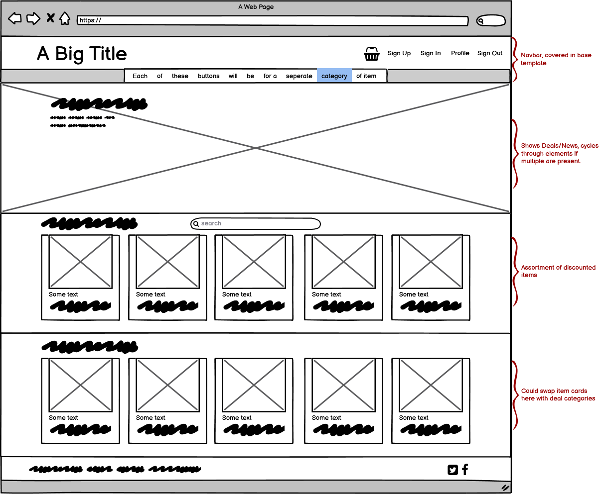
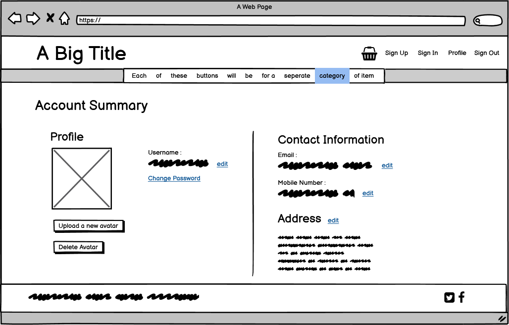
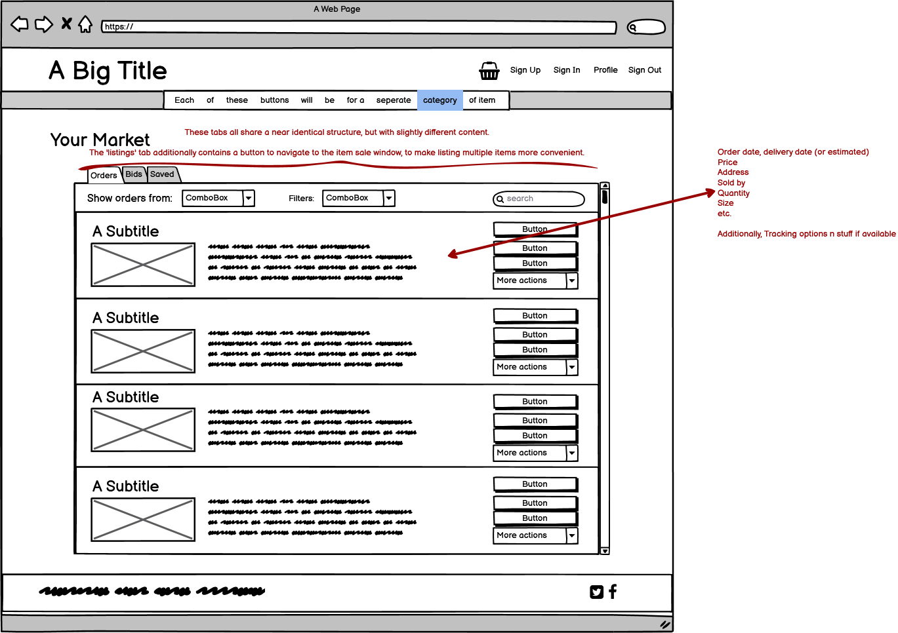
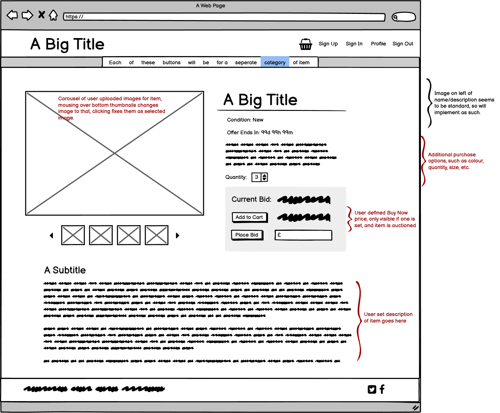
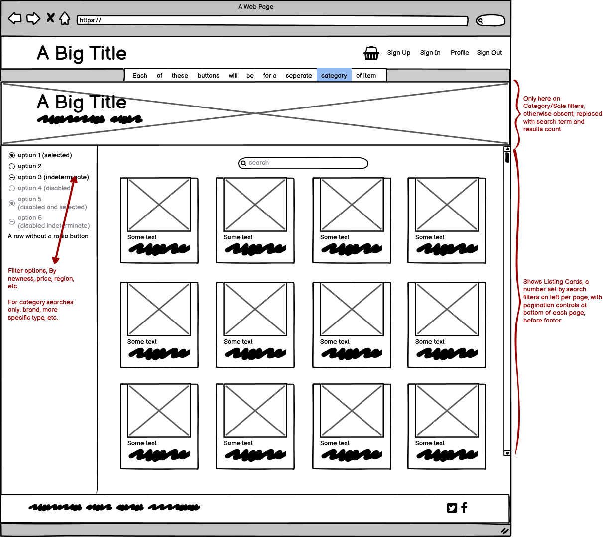
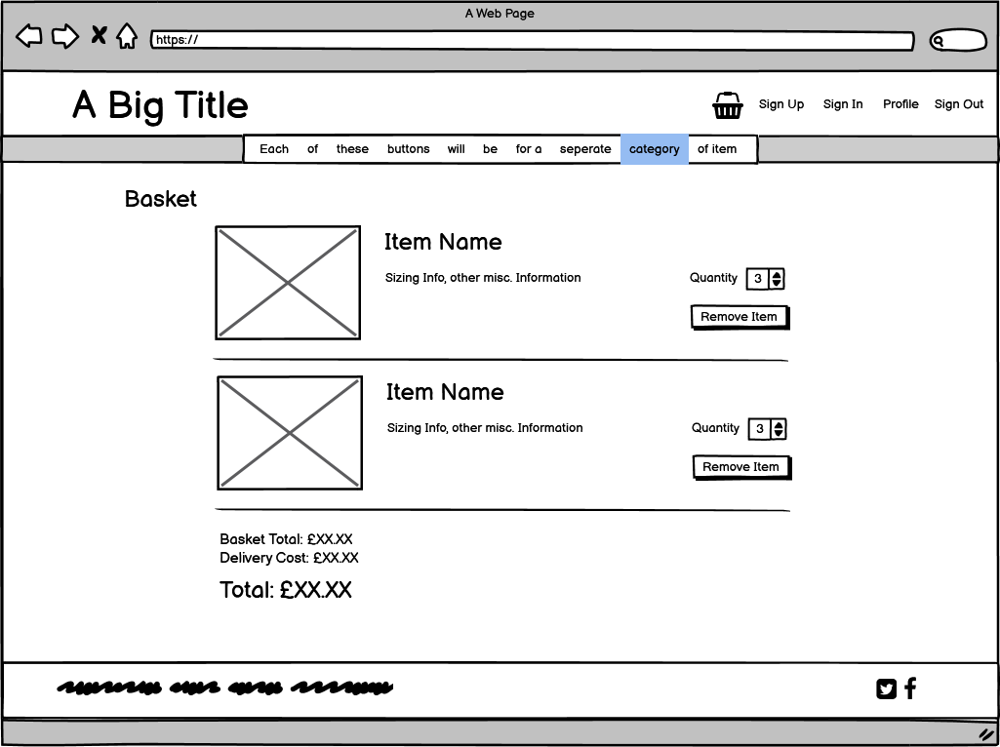
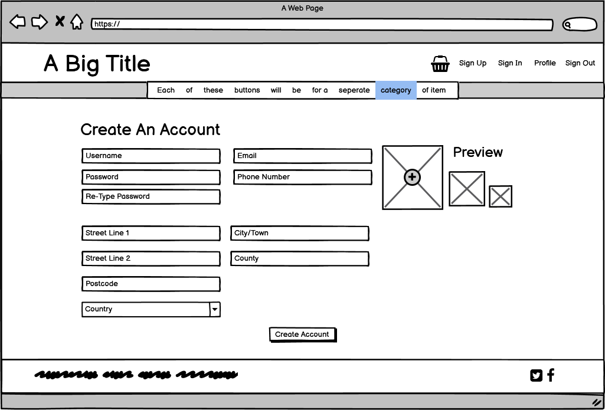
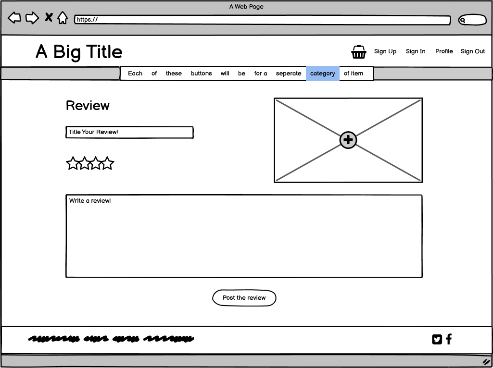
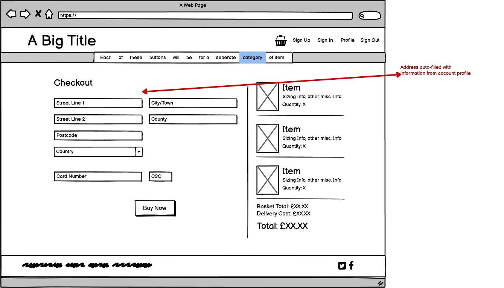
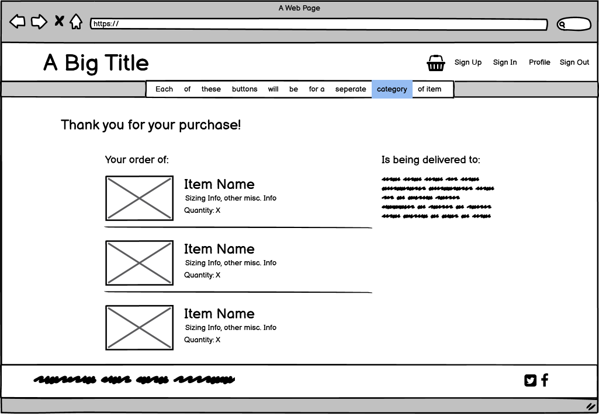

### Database Diagram
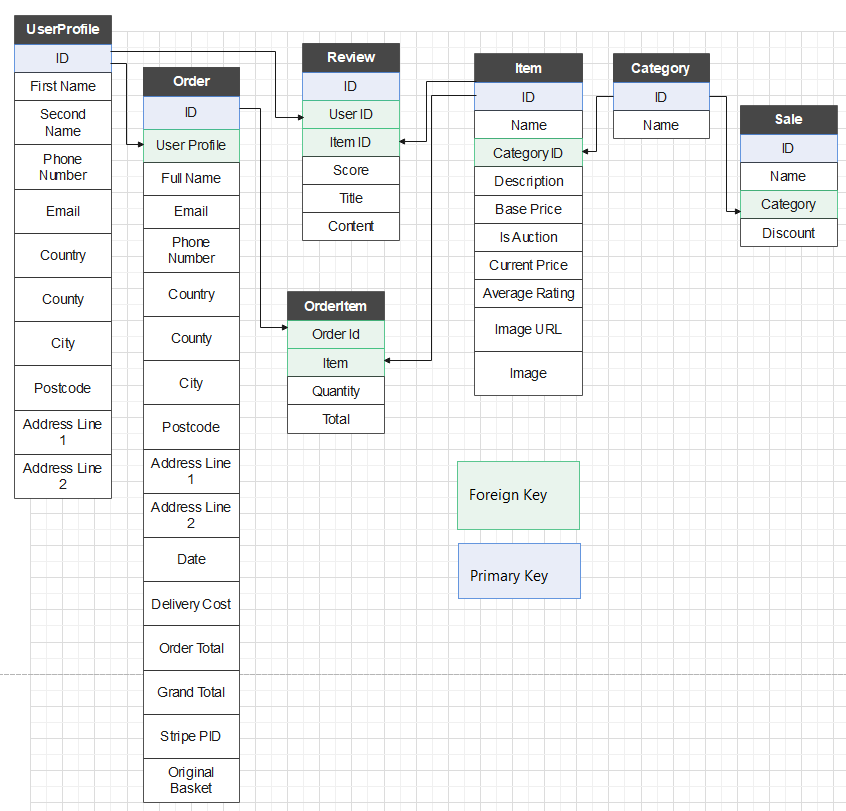

--- 

### Surface
#### Colour Palette and Design Philosophy For Site
The main design philosophy for this site's visuals is to merge elements of the more modern minimalistic style of site design with the older content-heavy methods, in order to create a easily readable and clean style that shows as much content as possible without overloading the user and causing content to become visual noise.
To that end, a higher-contrast colour palette has been chosen, in order to make the elements distinct.

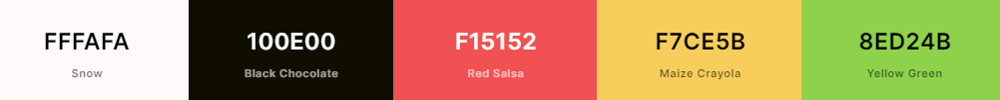